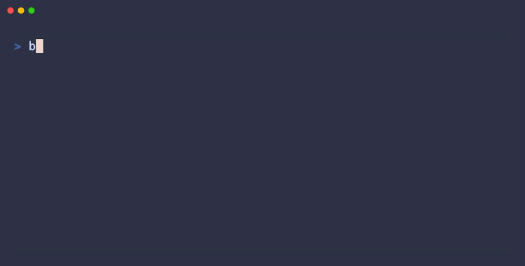

# Effect Boxes

[](https://www.npmjs.com/package/effect-boxes)
[](./LICENSE)
[](https://www.typescriptlang.org/)
[](https://effect.website)

A functional layout system for terminal applications built with Effect.js.
Create TUIs with composable boxes, ANSI styling, and reactive components.



## What is Effect Boxes?

Effect Boxes is a TypeScript library inspired by Haskell's
`Text.PrettyPrint.Boxes`, providing a flex-style layout system for terminal applications within the Effect ecosystem. Think of it as CSS flexbox, but built for functional composition of elements in terminal UIs, ASCII art, and structured text output.

## Features

- **Flex-y Layout System** — Horizontal and vertical composition with alignment
  control
- **Text Flow** — Automatic paragraph wrapping and column layout
- **ANSI Color Support** — Rich terminal styling with colors and text attributes
- **Reactive Components** — Dynamic UIs with efficient partial updates
- **Effect Integration** — Pipeable, Equal, Hash, and dual-function APIs
- **Unicode Aware** — Correct width calculations for full-width characters and
  emoji

## Installation

```bash
npm install effect-boxes
# or
bun add effect-boxes
# or
pnpm add effect-boxes
```

## Quick Example

```typescript
import { Box, Ansi } from "effect-boxes";

const myBox = Box.hsep(
  [
    Box.text("Hello").pipe(Box.annotate(Ansi.green)),
    Box.text("\nEffect").pipe(Box.annotate(Ansi.bold)),
    Box.text("Boxes!").pipe(Box.annotate(Ansi.blue)),
  ],
  1,
  Box.left
);

console.log(Box.renderPrettySync(myBox));
```

## Documentation

Full documentation, guides, and API reference are available at
[effect-boxes.lloydrichards.dev](https://effect-boxes.lloydrichards.dev).

For library-specific details (modules, usage guides, common patterns), see the
[package README](./packages/effect-boxes/README.md).

## Repository Structure

This project is organized as a monorepo:

| Path | Description |
| --- | --- |
| [`packages/effect-boxes`](./packages/effect-boxes) | Core library (published to npm) |
| [`apps/docs`](./apps/docs) | Documentation website |
| [`apps/scratchpad`](./apps/scratchpad) | Development playground |

## Contributing

See [CONTRIBUTING.md](./CONTRIBUTING.md) for development setup and workflow.

```bash
bun install        # Install dependencies
turbo run build    # Build all packages
turbo run test     # Run all tests
```

## License

BSD-3-Clause

Inspired by Haskell's `Text.PrettyPrint.Boxes` by Brent Yorgey.
