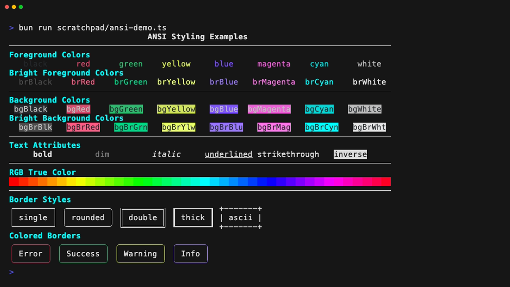

# ANSI Module

The ANSI module provides terminal styling capabilities for boxes, allowing you
to add colors, text formatting, and other terminal effects to your layouts.



## Core Concepts

The ANSI module uses the Annotation system to attach styling information to
boxes. When rendering with `{ style: "pretty" }`, these annotations are
converted to ANSI escape sequences that most modern terminals understand.

## Basic Usage

### Text Colors

```typescript
import { pipe } from "effect";
import * as Box from "effect-boxes/Box";
import * as Ansi from "effect-boxes/Ansi";

// Create a red text box
const redText = pipe(Box.text("Error!"), Box.annotate(Ansi.red));

// Create a green text box
const greenText = pipe(Box.text("Success!"), Box.annotate(Ansi.green));

// Print with ANSI colors enabled
console.log(Box.renderPrettySync(redText));
```

### Background Colors

```typescript
import { pipe } from "effect";
import * as Box from "effect-boxes/Box";
import * as Ansi from "effect-boxes/Ansi";

// Text with background color
const highlighted = pipe(Box.text("Warning"), Box.annotate(Ansi.bgYellow));

// Combine foreground and background colors
const colorCombo = pipe(
  Box.text("Important"),
  Box.annotate(Ansi.combine(Ansi.white, Ansi.bgRed))
);
```

### Text Formatting

```typescript
import { pipe } from "effect";
import * as Box from "effect-boxes/Box";
import * as Ansi from "effect-boxes/Ansi";

// Bold text
const boldText = pipe(Box.text("Bold"), Box.annotate(Ansi.bold));

// Underlined text
const underlinedText = pipe(
  Box.text("Underlined"),
  Box.annotate(Ansi.underlined)
);

// Italic text
const italicText = pipe(Box.text("Italic"), Box.annotate(Ansi.italic));

// Combine multiple text attributes
const formattedText = pipe(
  Box.text("Important"),
  Box.annotate(Ansi.combine(Ansi.bold, Ansi.underlined))
);
```

## Advanced Color Support

### 256-Color Mode

```typescript
import { pipe } from "effect";
import * as Box from "effect-boxes/Box";
import * as Ansi from "effect-boxes/Ansi";

// Use 256-color palette (0-255)
const color256Text = pipe(
  Box.text("256 Colors"),
  Box.annotate(Ansi.color256(39)) // Deep purple
);

const bg256Text = pipe(
  Box.text("256 Colors"),
  Box.annotate(Ansi.bgColor256(39)) // Deep purple background
);
```

### True Color (RGB)

```typescript
import { pipe } from "effect";
import * as Box from "effect-boxes/Box";
import * as Ansi from "effect-boxes/Ansi";

// Use true color (RGB)
const rgbText = pipe(
  Box.text("RGB Color"),
  Box.annotate(Ansi.colorRGB(255, 100, 50)) // Custom orange
);

const bgRgbText = pipe(
  Box.text("RGB Background"),
  Box.annotate(Ansi.bgColorRGB(50, 100, 255)) // Custom blue background
);
```

## Combining Styles

The `combine` function merges multiple ANSI styles, resolving conflicts with a
last-wins strategy:

```typescript
import { pipe } from "effect";
import * as Box from "effect-boxes/Box";
import * as Ansi from "effect-boxes/Ansi";

// Combine multiple styles
const multiStyled = pipe(
  Box.text("Styled Text"),
  Box.annotate(
    Ansi.combine(
      Ansi.bold,
      Ansi.underlined,
      Ansi.colorRGB(255, 100, 50),
      Ansi.bgBlue
    )
  )
);
```

## Rendering with ANSI

To render boxes with ANSI styling, use the sync render functions:

```typescript
import { pipe, Effect } from "effect";
import * as Box from "effect-boxes/Box";
import * as Ansi from "effect-boxes/Ansi";
import { AnsiRendererLive } from "effect-boxes/Renderer";

const styledBox = pipe(Box.text("Hello!"), Box.annotate(Ansi.bold));

// Render with ANSI colors enabled (synchronous)
const rendered = Box.renderPrettySync(styledBox);
console.log(rendered);

// Print using Effect (asynchronous)
const program = Box.printBox(styledBox).pipe(Effect.provide(AnsiRendererLive));
Effect.runPromise(program);
```

## See Also

- [Box Module](./using-box.md) - Core box creation and composition
- [Annotation Module](./using-annotation.md) - The underlying annotation system
- [Common Patterns](./common-patterns.md) - For practical examples and reusable
  patterns
